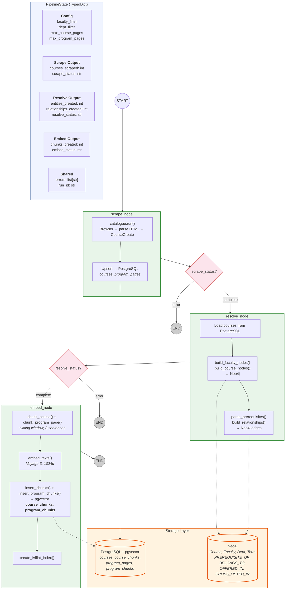

# McGill Pipeline — LangGraph Workflow

```mermaid
flowchart TD
    subgraph State["PipelineState (TypedDict)"]
        direction LR
        CFG["<b>Config</b><br/>faculty_filter<br/>dept_filter<br/>max_course_pages<br/>max_program_pages"]
        S1["<b>Scrape Output</b><br/>courses_scraped: int<br/>scrape_status: str"]
        S2["<b>Resolve Output</b><br/>entities_created: int<br/>relationships_created: int<br/>resolve_status: str"]
        S3["<b>Embed Output</b><br/>chunks_created: int<br/>embed_status: str"]
        ERR["<b>Shared</b><br/>errors: list[str]<br/>run_id: str"]
    end

    START((START)) --> scrape

    subgraph scrape["scrape_node"]
        SC1["catalogue.run()<br/>Browser → parse HTML → CourseCreate"]
        SC2["Upsert → PostgreSQL<br/><i>courses, program_pages</i>"]
        SC1 --> SC2
    end

    scrape --> cond1{scrape_status?}
    cond1 -- "error" --> END1((END))
    cond1 -- "complete" --> resolve

    subgraph resolve["resolve_node"]
        R1["Load courses from PostgreSQL"]
        R2["build_faculty_nodes()<br/>build_course_nodes()<br/>→ Neo4j"]
        R3["parse_prerequisites()<br/>build_relationships()<br/>→ Neo4j edges"]
        R1 --> R2 --> R3
    end

    resolve --> cond2{resolve_status?}
    cond2 -- "error" --> END2((END))
    cond2 -- "complete" --> embed

    subgraph embed["embed_node"]
        E1["chunk_course() + chunk_program_page()<br/><i>sliding window, 3 sentences</i>"]
        E2["embed_texts()<br/><i>Voyage-3, 1024d</i>"]
        E3["insert_chunks() + insert_program_chunks()<br/>→ pgvector <b>course_chunks, program_chunks</b>"]
        E4["create_ivfflat_index()"]
        E1 --> E2 --> E3 --> E4
    end

    embed --> END3((END))

    subgraph Databases["Storage Layer"]
        direction LR
        PG[("PostgreSQL + pgvector<br/><i>courses, course_chunks,<br/>program_pages, program_chunks</i>")]
        N4[("Neo4j<br/><i>Course, Faculty, Dept, Term<br/>PREREQUISITE_OF, BELONGS_TO,<br/>OFFERED_IN, CROSS_LISTED_IN</i>")]
    end

    SC2 -.-> PG
    R2 -.-> N4
    R3 -.-> N4
    E3 -.-> PG

    classDef stateBox fill:#f0f4ff,stroke:#4a6fa5,stroke-width:1px
    classDef nodeBox fill:#e8f5e9,stroke:#388e3c,stroke-width:2px
    classDef dbBox fill:#fff3e0,stroke:#e65100,stroke-width:2px
    classDef condBox fill:#fce4ec,stroke:#c62828
    classDef endNode fill:#ccc,stroke:#666

    class State stateBox
    class scrape,resolve,embed nodeBox
    class Databases,PG,N4 dbBox
    class cond1,cond2 condBox
    class END1,END2,END3 endNode
```
